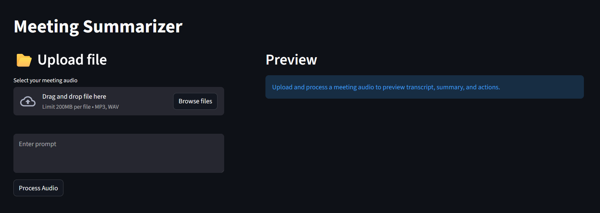
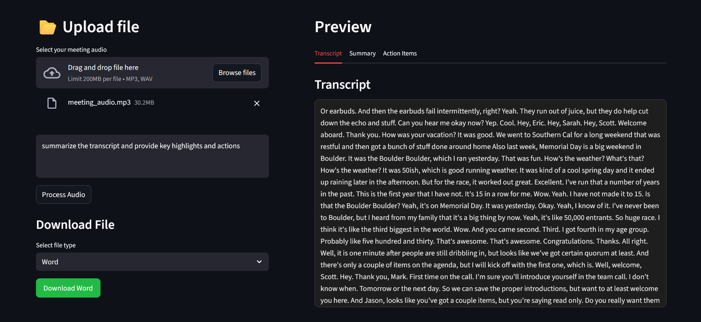
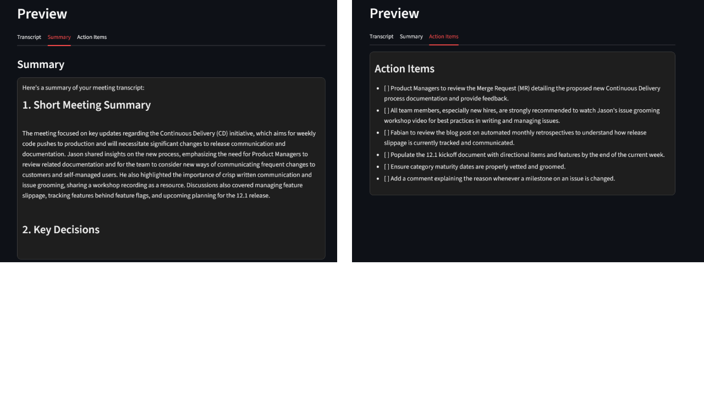
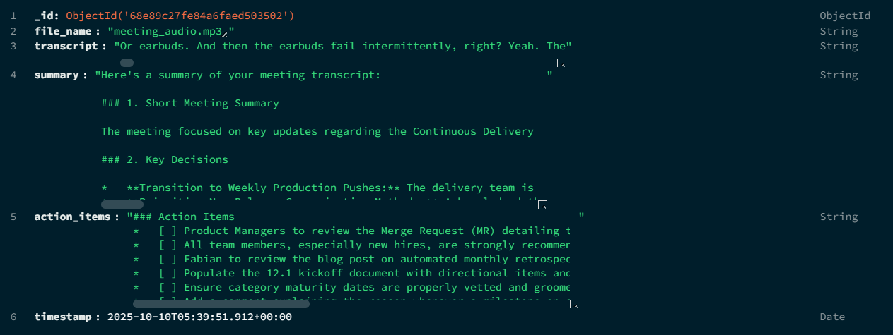

# Meeting Summarizer

##  Description
A Streamlit-based audio transcription and summarization tool that allows users to upload audio files, generate transcripts, extract summaries, and identify actionable items using tools like streamlit, Mongodb, Assemplyai api, Gemini api. PDF,Word,md download option and a simple UI.

---

##  Installation

```bash
# 1️ Create Virtual Environment
py -m venv venv

# 2️ Install Dependencies
pip install -r requirements.txt

# 3️ Run the App
streamlit run app.py
```

---

## Preview
Implemented on a real product meeting audio file (meeting link - https://www.youtube.com/watch?v=yX0n5PqO9qU&t=184s)

   
 
---

###  Demo Video

<video width="720" height="480" controls>
  <source src="demo_video.mp4" type="video/mp4">
  Your browser does not support the video tag.
</video>

---

##  Features

-  Audio Upload  
-  Transcription  
-  Text Summarization  
-  Action Items Extraction  
-  PDF,Word,md Export 

---

## Working Process

1. **Upload Audio** — User uploads an audio file (MP3/WAV).  
2. **Transcription** — Audio is processed and converted to text.  
3. **Summarization** — The transcript is summarized using an AI model.  
4. **Action Extraction** — Tasks and action items are automatically identified.  
5. **Export** — Results can be downloaded as PDF,Word,md.

---

###  Database Storage
Uses MongoDB for storage of summarizations  



---

